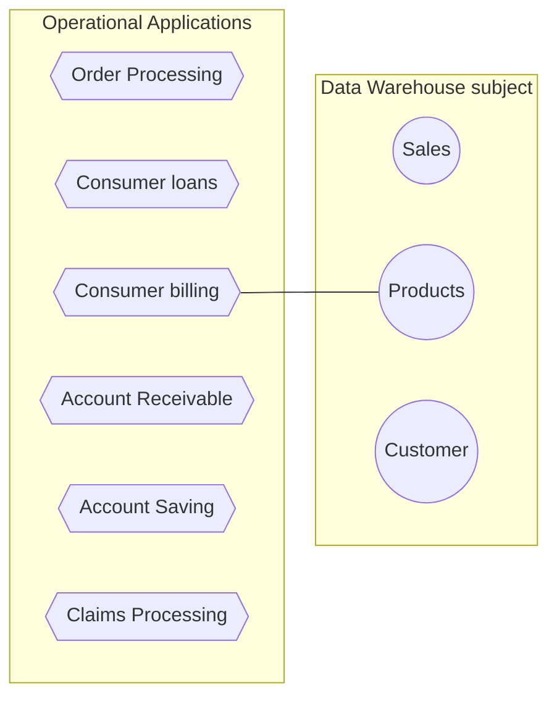
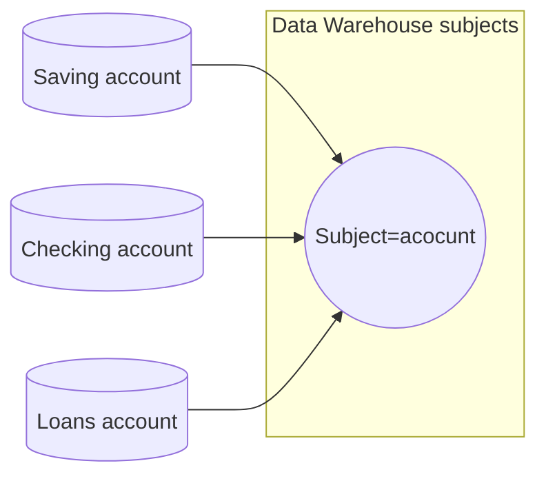
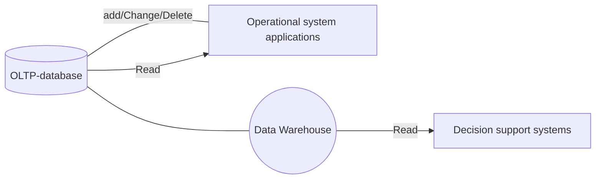
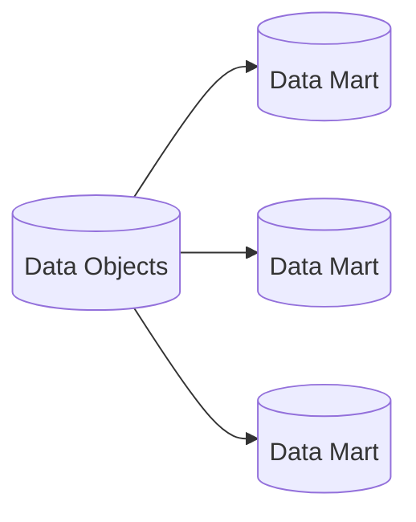

## Data Warehouse(DW)

- is a relational database that `is designed for query and analysis rather than transaction processing`. It includes historical data derived from `transaction data from single and multiple sources`.
- A Data Warehouse is a `group of data specific to the entire organization`, not only to a particular group of users.

## Meta Data

- the data or documentation about `the information` which is `required by the users`. In data warehousing, metadata is one of the essential aspects.

## Following attributes

1. It is a database designed for investigative tasks, using data from various applications.
2. supports a `relatively small number of clients` with relatively `long interactions`.
3. includes `current and historical data` to provide a `historical perspective of information`.
4. Its usage is `read-intensive`.
5. It contains a few large tables.

## Characteristics of Data Warehouse

1. Subject-oriented(物件性)
2. Integrated(整合性)
3. Time-Variant(時間變數)
4. Non-Volatile(非易失性)

### Subject-Oriented

- data warehouses typically `provide a concise and straightforward view around a particular subject`, such as customer, product, or sales, instead of the `global organization's ongoing operations`.

### Integrated

- . It requires performing data `cleaning and integration during data warehousing to ensure consistency in naming conventions`, attributes types, etc.

### Time-Variant

- one can retrieve files from 3 months, 6 months, 12 months, or even previous data from a data warehouse.

### Non-Volatile

- once entered into the warehouse, and `data should not change`.

## Goals of Data Warehousing

- to help reporting as well as analysis.
- maintain the organization's history information.
- Be the foundation for decision making.

## Need of Data Warehouse

1. Business User
2. Store historical data
3. Make strategic decisions
4. For data consistency and quality
5. High response time

## Data Staging Component

1. Data Extraction
   - We have to deal with numerous data sources with appropriate techniques.
2. Data Transformation
   - contains purging source data that is not `useful and separating outsource records` into new combinations.
   - that is cleaned, standardized, and summarized.
3. Data Loading
   - we do the `initial loading of the information into the data warehouse storage`.

## Data Mart

- The fundamental use of a data mart is Business Intelligence (BI) applications.
- be used by smaller businesses to utilize the data they have accumulated since it is `less expensive than implementing a data warehouse`.

> BI is used to gather, store, access, and analyze record.

## Reasons for creating a data mart

- Create collective data by a group of users.
- Ease of creation.(易於建立)
- `Improves end-user response time`.
- Potential clients are more `clearly defined than` in a `comprehensive data-warehouse`.
- It contains only `essential business data` and is `less cluttered`.
