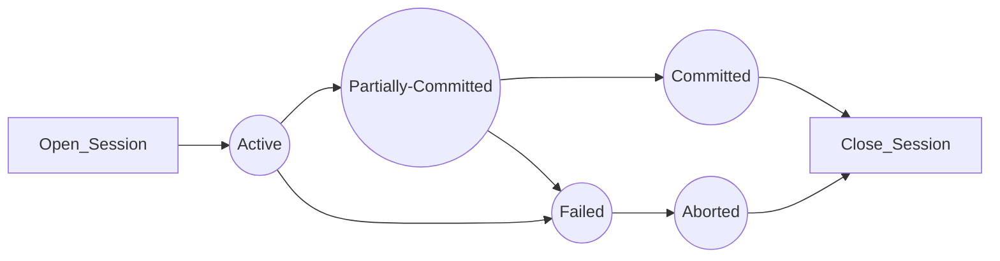
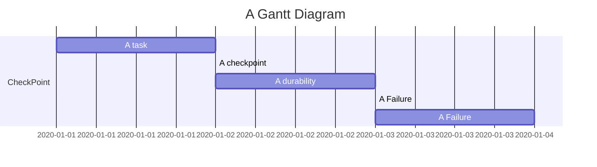

## Transaction

## 1.The transaction has the four properties.

### 1.1 Atomicity

> means either all successful or none

### 1.2 Consistency

> Ensure the consistent from one consistant to another consistant state. 寫入的資料必須完全符合所有的預設
> ATM-deposit

### 1.3 Isolation

> Ensure that transaction is isolated from other transaction.

### 1.4 Durability(耐用性)

> means once a transaction has been commited,it'll remain it ,even in the event of power loss.

## 2.State of Transaction Flow

### Active state 

> `Insertion or deletion or updating` a record is done here. But all the records are `still not saved to` the database.

## 3.Failure Classification

1. Transaction failure
2. System Crash
3. Disk failure

## 4.Log-based Recovered
- When the system is crashed, then the system `consults the log to find` which transactions need to be undone and `which need to be redone`.
1. Start
><Tn, Start>
2. transaction Modifies
><Tn, City,'Nokia','Bang'>
3. finished
><Tn,Commit>

## 5.CheckPoint-Recovered

- The checkpoint is a type of mechanism which is like to bookmark

## DeadLock 

- A deadlock is a condition where `two or more transactions are waiting indefinitely for` one `another to give up locks`.