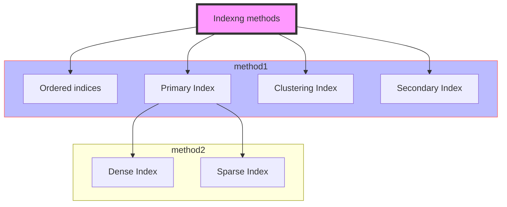

## Index

> `optimize the performance` of a database by `minimizing the number of disk accesses` required when a query is processed

Index | Structure |
---------|------|
 Search-key |  Data-reference

## 1. Indexing Method

## 2. B+ Tree 

> Big-O (O) ->即最糟情況下的執行次數(COST)

- `balanced binary search tree`. It follows a `multi-level index` format
  
-  leaf nodes denote actual data pointers. B+ tree ensures that `all leaf nodes remain at the same height`.

- using a `link list`. Therefore, a B+ tree can support random access as well as `sequential access`.