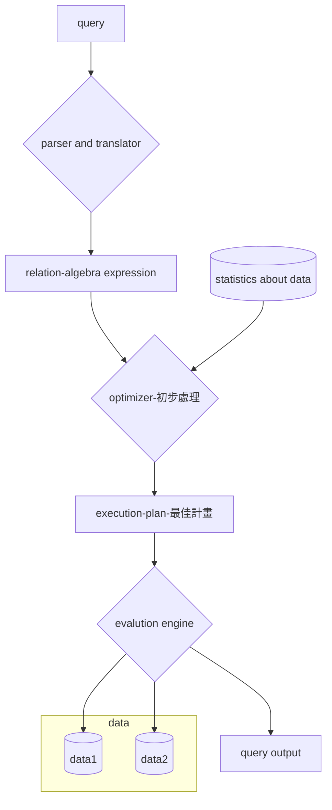

## Query Processing

- extracting data from the database

1. Parsing and translation
2. Optimization
3. Evaluation

## STEPs in Query Processing

## Optimization
- The cost of the query evaluation can `vary for different types of queries.` 
- the query `optimizer should have an estimated cost analysis of each operation`. It is because the overall operation `cost depends on the memory allocations` to several operations, `execution costs`, and so on.

## Evaluation

- In order to fully evaluate a query, the system `needs to construct a query evaluation plan` which is also referred to as the `query execution plan`.