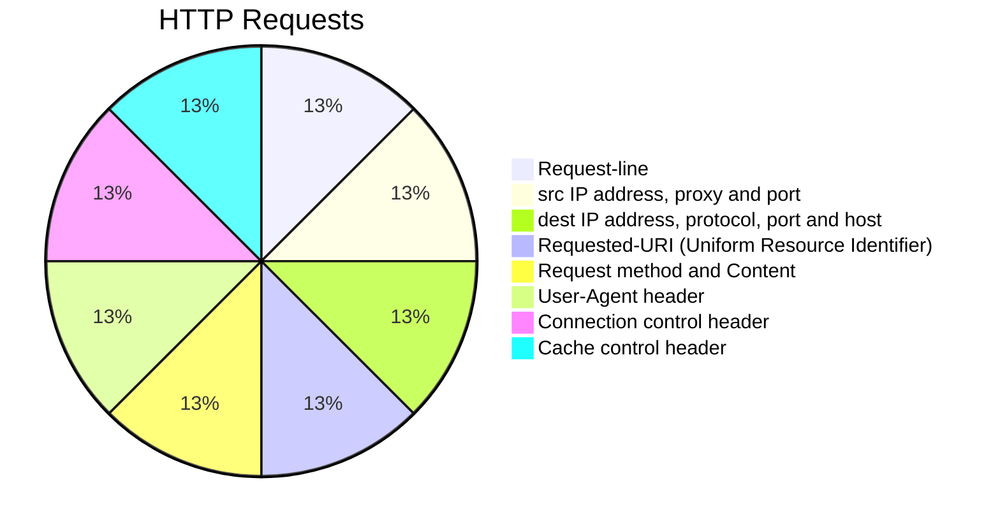

## HTTP Request

- The request `sent by the computer to a web server`, `contains all sorts of potentially interesting information`;

## Include following information

- The Request-line
- source IP address,`proxy and port`.
- The analysis of destination IP address, protocol,`port and host`.
- The Requested URI(`Uniform Resource Identifier`)
- The Request method and Content
- The User-Agent header
- The Connection control header
- The Cache control header

## Requested_URI

> This method is `case-sensitive` and should `be used in uppercase`.

## HTTP Request methods

|HTTP Request|Description |
|------------|------------|
|GET |Asks to get the resource at the requested URL. |
|POST |Asks the server to accept the body info attached. It is like GET request with extra info sent with the request. `Message body`|
|PUT |Says to put the enclosed info (the body) at the requested URL. |
|DELETE |Says to delete the resource at the requested URL.

## Request Methods diff between GET and POST

---

|GET |POST   |
|------|-------------|
|1) `only limited amount of data` can be sent because data is `sent in header`.|In `large amount of data` can be sent because data is `sent in body`. |
|2) Get request is `not secured because data is exposed in URL bar`.|Post request is secured because `data is not exposed in URL bar.`  |
|3) Get request `can be bookmarked`.|Post request `cannot be bookmarked.`   |
|4) Get request is `idempotent`(It means `second request will be ignored until response of first request is delivered`|Post request is non-idempotent. 不同的request 會影響 response |
|5) Get request is `more efficient and used more than Post`.|Post request is `less efficient and used less than get.`|

## request-response between a server and client are

- GET- `requests the data` from a specified resource.
- POST- It `submits the processed data` to the specified resourc`.

## Content Type

- Content Type is also known as `MIME` (Multipurpose internet Mail Extension)Type

### MIME

> is a `HTTP header provides the description` about what are you `sending to the browser`.
> MIME(Multipurpose internet Mail Extension) 
> `Internet standard`that is used for extending the `limited capabilities of  email`by allowing the insertion of sounds, images and text in a message.

## The features provided by MIME to the mail services

- support the `non-ASCII characters.`
- support the `multiple attachments`(多種附件) in a single message.
- supports the `unlimited message`length.

## Lists of Content Type

- text/html
- text/plain(較常使用json)
- application/msword
- application/vnd.ms-excel
- application/jar
- application/pdf
- application/octet-stream
- application/x-zip
- images/jpeg
