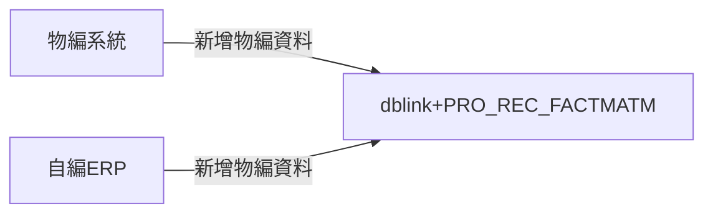
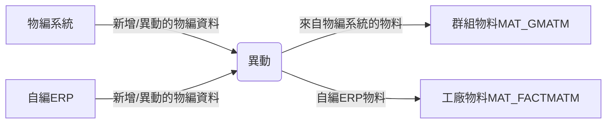
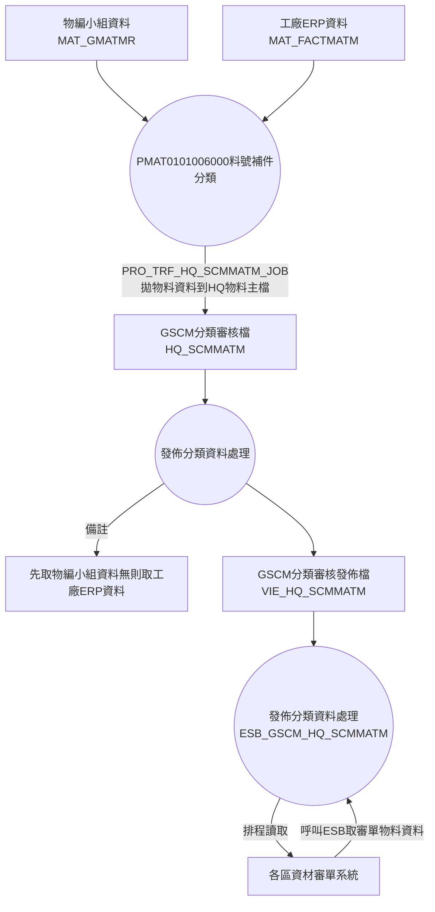

## 接收物編資料 :id=recFactMatm

- 提供BU物編系統/自編物料ERP傳出異動的物料資料，寫入資材分析物料檔。

>OLD dblink + PRO_REC_FACTMATM



>NEW ESB



`依物編群組(ESB.FACT_NO exist MAT_GROUP.GRP_NO)寫入的料號, 一律寫入物編群組料號檔
(MAT_GMATM)`

**其他寫入 工廠物料檔(MAT_FACTMATM)**

## ChangeLog

### 現行DBlink 仍會用到，全部轉移呼叫ESB後架構則可以拿掉如下欄位

- FACT_REC_DT 工廠接收時間
- TRF_FACT_MK 傳送各中心註記:Y-以傳送,N-未傳送,X-不傳送
- TRF_FACT_DT 傳送各中心時間
- TRF_HQ_MK 轉HQ_SCMMATM註記(N-未轉出, Y-已轉出)
- TRF_HQ_DT 轉HQ_SCMMATM時間

## SCM分類發佈-SCM分類差異-2019改版 diagram :id=pro_trf_scmmatm_diff

### key -> 拆解正常，驗證是否有註冊，且仍為有效Table：MAT_ESB_REGISTER

```sql
MAT_GMATM as M Union All MAT_FACTMATM as M
```

- 物料ERP + 物編系統呼叫
- ESB_GSCM_SCM_MATM(SCM分類差異資料)
- 取回資料同步

> 有收貨過則有分段料號<br>
> 無收貨，物編同步母料號(不含分段)

## [DFD]物料分類審核發佈-2019 改版 diagram :id=TRF_HQ_SCMMATM_Job

- 審核後的物料發佈

- 各區資材審單系統排程call ESB_GSCM_HQ_SCMMATM取審核完畢的物料資料。
- VIE_HQ_SCMMATM

- MAT_GMATM(物編小組資料) UNION ALL MAT_FACTMATM(工廠ERP資料)

> (1).[物編小組資料]:HQ_SCMMATM廠別存在存在物編群組廠別(MAT_GROUP_FACT)中<br>
(2).[工廠ERP資料]:HQ_SCMMATM廠別不存在物編群組(MAT_GROUP)且不存在物編群組廠別


