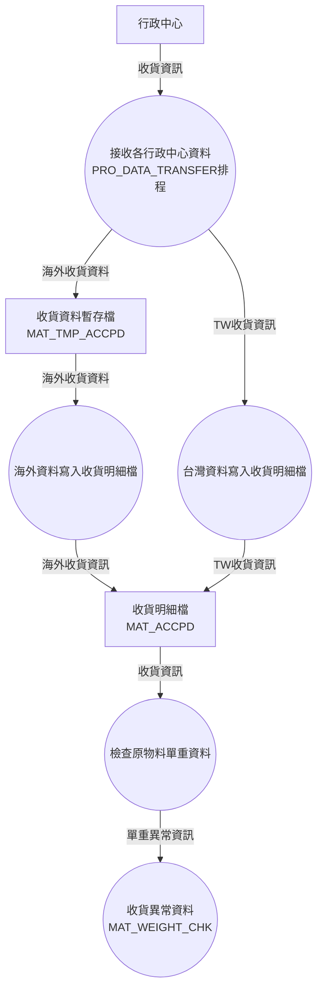
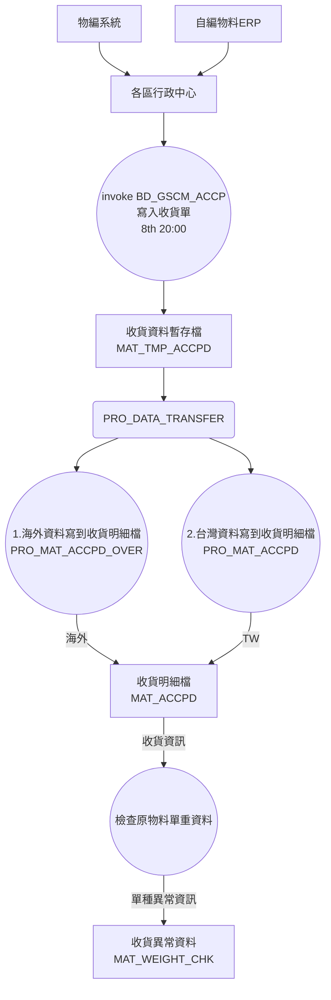

## 1. 收貨資料ETL(Extract-Transform-Load) :id=etl

- 接收工廠收貨資料

> 1. 資料接收公司廠別清單<br>
> 2. 收貨年月 = 上個月(排程執行年月 - 1個月)

## 2.MAT_WEIGHT_CHK(單重異常資料) :id=chkWeight

- CLAUSE ->單重為0 OR null為異常

## 3.[DFD]收貨單接收 diagram(Legacy) :id=recAccp



## 4.[DFD]收貨單接收-2019改版 diagram AS-IS :id=flow



## 5.BD_GSCM_ACCP :id=crongscmaccp

- 取各區行政中心(AIS)收貨單寫入資材分析

```sql
select * from MAT_SYSCODE where sys_keyname ='BD_GSCM_ACCP_DB';
```

- SYS_DATA8-運行MK(Y/N)
- SYS_DATA9-廠別(J8; J8,V2; %(default))

## 6.ETL(`Extract-Transform-Load`) :id=source

### 6.1 DataSource(`EXTRACT`)

> VIE_GSCM_ACCPD(各區收貨資料檔)

### 6.2 Data_Dist(`TRANSFORM`)
> MAT_TMP_ACCP(收貨資料暫存檔)

### 6.3 Data_accp(`LOAD`)
> MAT_ACCPD(收貨資料檔)

## 7.各區行政中心(AIS)條件 :id=ais

### 7.1 FUN_DATA_TRANSFER_PYC[2019/06/17]刪除

- 僅保留台灣區收貨資料條件，其餘刪除

### 7.1.2 例外處理
> 台灣區收貨資料條件: ADT.VIE_FINANCE_ACCEPTM@LUXPCCDB(台灣AIS) 固定地區別為
V003 平政[ESB上線後，保留]
- 公司別(P65,P33)

### 7.2 FUN_DATA_TRANSFER_CHINA 

- 僅保留廠別724,TW區收貨條件

### 7.2.2 例外處理
>3.2.例外處理-廠別724由TW區收收貨資料-來源: ADT.VIE_FINANCE_ACCEPTM@LUXPCCDB (台灣AIS)
地區別歸為C008 黃江
- 公司別('P20','P33')

### 7.3 FUN_DATA_TRANSFER_BDPH
- BDPH廠，ESB 上線後，後續考慮需刪除]

### 7.4 FUN_DATA_TRANSFER_ID(印尼區)
- 印尼區-ESB上線後，後續需考慮刪除]

