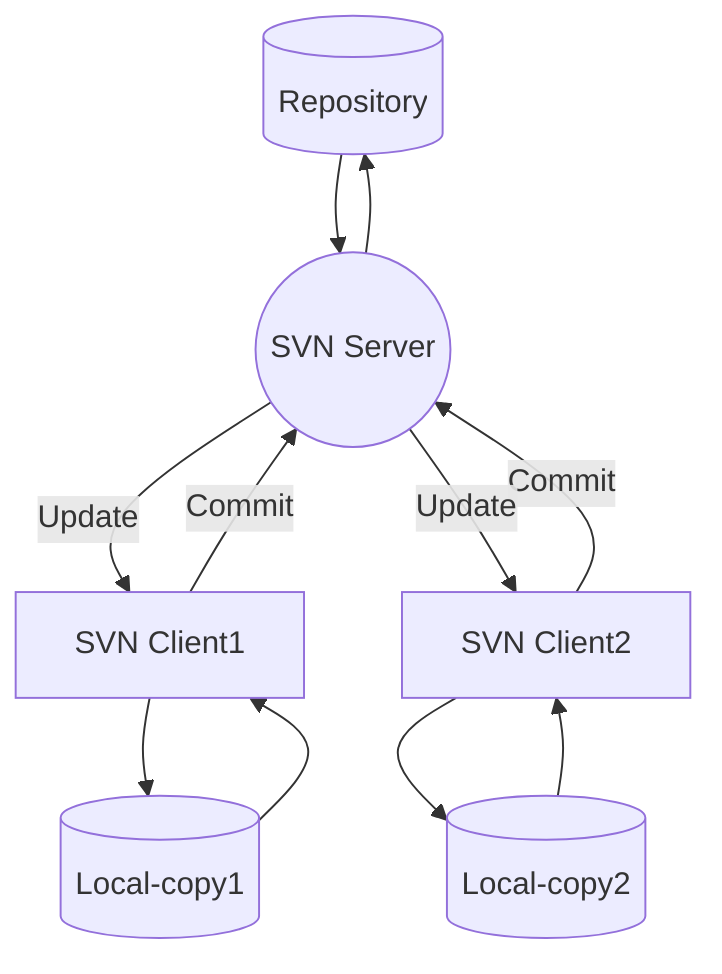

## SVN(Subversion)

- centralized version control system

- Subversion is open-source and comes `under the Apache License`.

## Features of SVN

- supports atomic commits(occur or not)
- keeps a full revision history.
- It provides `file locking for the files that cannot be merged`.
- supports `path-based authorization`.
- a standalone server option (svn-server).

## SVN-Server

- It provides security to customer.
- provides the read and write access to multiple destinations `through the SVN client-server`.

## SVN-Client

- It is free and open-source.
- It communicates with the SVN server.
- i.e. `Tortoise SVN`, Collabnet, and Visual SVN clients.

## SVN vs. Git

|SVN   |Git      |
|------|------------|
|It's a `Centralized version control` system|It's a `distributed version control` system. |
|It is revision control.|Git is an `SCM (source code management)`. |
|It does not keep a cloned repository.|It has `a cloned repository`.  |
|Branches in SVN `are a folder that takes place in the repository`. Some special commands are required For merging the branches.|The `Git branches are familiar to work`. The Git system helps in `merging the files quickly and also assists in finding the unmerged ones`.|
|It has an `internationalized revision number`.|It does not have a `Global revision number`.  |
|SVN does not contain any cryptographically hashed contents.|It has `cryptographically hashed contents that protect the contents from repository corruption` taking place due to network issues or disk failures.|
|SVN stores content as `files`.|Git stored content as `metadata`.    |
|SVN's content is less secure than Git.|Git has `more content protection than SVN`     |
|CollabNet, Inc developed SVN.|Linus Torvalds developed git for Linux kernel.   |
|SVN is distributed `under the open-source license`.|Git is `distributed under GNU` (General public license).     |
