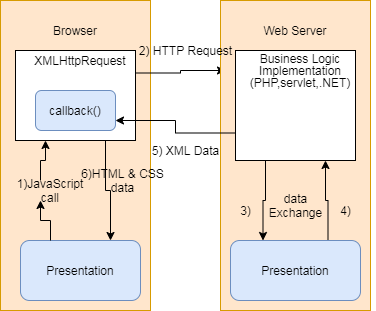

## AJAX

- AJAX is an acronym(首字母縮寫) for `Asynchronous JavaScript and XML`. It is a group of inter-related technologies like `JavaScript, DOM, XML, HTML/XHTML, CSS, XMLHttpRequest` etc
- send and receive data `asynchronously without reloading the web page`. So it is `fast`.

## Synchronout vs Asynchronous

- Note: `every blocking operation is not synchronous` and every `unblocking operation is not asynchronous`.

## AJAX Technologies

- AJAX technologies consist of
  - HTML/XHTML/CSS (displaying content and style)
  - DOM (Used for `dynamic display and interaction with data`.)
  - XML or JSON (carrying data to and from server)
  - XMLHttpRequest (For `asynchronous communication` between client and server.)
  - Javascript (it is used mainly for `client-side validation`.)

## Understanding XMLHttpRequest

- For `asynchronous communication` between client and server.

1. `Sends data from the client` in the background.
2. Receives the data from the server
3. Updates the webpage without reloading it.

## Properties of XMLHttpRequest object

- The common properties of XMLHttpRequest object

|Property          |Description          |
|------------------|---------------------|
|onReadyStateChange|It is called whenever `readystate attribute changes`. It must `be used with synchronous requests.`   |
|readyState        |represents the state of the request. It ranges from 0 to 4. `0 UNOPENED open() is not called`.  `1 OPENED open is called` but send() is not called.  2 HEADERS_RECEIVED `send() is called, and headers and status are available`.  3 LOADING Downloading data; `responseText holds the data`.  4 DONE The operation is `completed fully`.|
|reponseText       |returns response as text. |
|responseXML       |returns response as XML   |

## Methods of XMLHttpRequest Object

- The important methods of XMLHttpRequest object are as follows

|Method  |Description          |
|------------------|--------------------|
|void open(method, URL)|opens the `request specifying get or post method and url.`      |
|void open(method, URL, async)|same as above but specifies `asynchronous or not.`    |
|void open(method, URL, async, username, password)|same as above but specifies username and password.  |
|void send()       |`sends get request`.   |
|void send(string) |send post request.   |
|setRequestHeader(header,value)|it `adds request headers.`    |

## How AJAX works

- AJAX communicates with the server using XMLHttpRequest object.

1. User sends a `request from the UI and a javascript call goes to XMLHttpRequest object`.
2. HTTP Request is sent to the server by XMLHttpRequest object.
3. Server `interacts with the database using JSP, PHP, Servlet, ASP.net` etc.
4. Data is retrieved.
5. Server sends `XML data or JSON data to the XMLHttpRequest` callback function.
6. HTML and CSS data is displayed on the browser.
