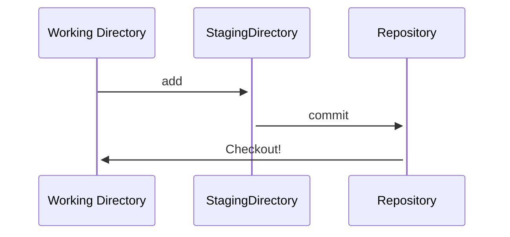

## Git

- Git is a modern and widely used `distributed version control system` in the world. It is developed to manage projects with `high speed and efficiency`.

- Git is an `open-source distributed version control system`.

- Git is　`foundation of many services like GitHub and GitLab`, but we can use Git without using any other Git services. Git can `be used privately and publicly`. It is superior to other SCM `Software Configuration Management` tools like Subversion, CVS...

## Features of Git

- Open Source
- Scalable
- Distributed
- Secure
- Speed

### open Source
- Git is an open-source tool. It's released under the GPL(General Public License).

### Scalable
- Git can `easily handle the numbers of users increases`.

### Distributed
- means that `instead of switching the project to another machine`, we can create a "clone" of the entire repository.

### Security
- used the `SHA1(Secure Hash Function) to name and identify objects` within its repository.

### Speed 
- Most of the git operations are done on the local repository, so it `provides a huge speed`.
- Git was developed to work on the linux kernel,which is written in `C` and it's `capable enough to handle large repositories `.

### Supports non-linear development
- supports `seamless[無接縫] branching and merging`.

## `Branching and Merging`
- `branching and merging` are the great features of Git.
- allows `the creation of multiple branches without affecting` each other.
-  We can perform tasks like `creation, deletion, and merging on branches`, and these tasks take `a few seconds only`. Below are some features that can be achieved by branching:
   - We can `create a separate branch for a new module of the project`, commit and delete it whenever we want.
   - We can have a production branch,which goes into production and can be merged for testing in the test branch...
   - We can create a `demo branch for the experiment` and check if it is working.`We can remove it if needed`.

## Staging Area
- means `unique functionality` of Git.
- It can be considered as a `preview of our next commit`,moreover an intermediate area where commits can be formattedd and reviewed before completion.
- The staging area can be considered as `a place where Git stores the changes`.

## Benefits of Git

- Save Time
- Offline working
- Undo Mistakes
- Track Changes

### Saves time
- Git is `lightning fast technology`.

### Offline Working
- In Git, we can do almost everything locally.
- other CVS like SVN is `limited and connect with the central repository`.

### Undo Mistakes
- We can `Undo` option for almost everything mistakes.

### Track the Changes
- Git facilitates with some exciting features such as `Diff,Log,Status`.

|Git   |GitHub   |
|-----------|-------------------|
|Git is a `distributed version control tool` that can manage a programmer's source code history.|GitHub is a `cloud-based tool developed` around the Git tool.   |
|A developer `installs Git tool locally`.  |GitHub is an `online service to store code and push from the computer` running the `Git tool`.|
|Git `focused on version control and code sharing`.  |GitHub focused on `centralized source code hosting`.(集中式管理)   |
|It is a `command-line tool`.  |It is `administered through the web`.  |
|It facilitates with a desktop interface called `Git Gui`. |It also facilitates with a `desktop interface called GitHub Gui.`  |
|Git does not provide `any user management feature`. |GitHub has a built-in user management feature. |

## Git has more advantages than SVN

|Git    |SVN |
|---------------------------------------------------------------------------------------------|------------------------------------------------------------------------------------------|
|It's a `distributed version control system`. [分散式管理] |It's a Centralized version control system .[集中式管理]   |
|Git is an SCM (source code management).  |SVN is `revision control`.[修訂控制]  |
|Git has `a cloned repository`.   |SVN does `not have a cloned` repository.   |
|The Git branches are familiar to work. The `Git system helps in merging the files quickly and also assist in finding the unmerged ones`.|The SVN branches `are a folder which exists` in the repository. Some special commands are required For merging the branches.|
|Git does `not have a Global revision number`. |SVN has a Global revision number.  |
|Git has `cryptographically hashed contents` that protect the contents from repository corruption taking place due to network issues or disk failures.|SVN does not have any cryptographically hashed contents. |
|Git `stored content as metadata`.  |SVN stores content `as files`.  |
|Git has `more content protection` than SVN.   |SVN's content is less secure than Git.   |
|Linus Torvalds `developed git for Linux kernel`.  |CollabNet, Inc developed SVN. |
|Git is distributed under GNU (General public license).  |SVN is distributed under the open-source license. |