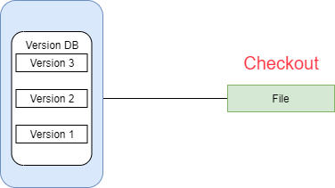
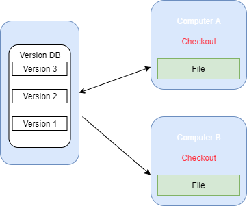
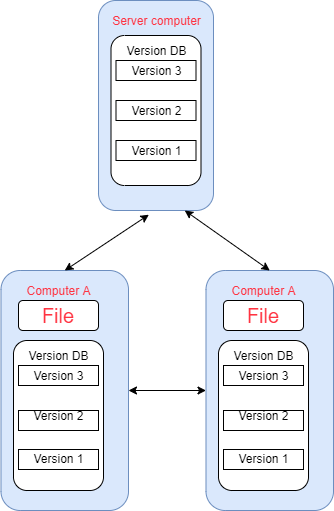

## Version Control System
- localized version Control System
- Centralized version control systems
- Distributed version control systems

## Localized Version Control Systems

---

## Centralized Version Control System

---
## Distributed Version Control
-  The local repository contains all the `files and metadata present in the main repository`.
- DVCS allows `automatic management branching and merging`. It speeds up of most operations except pushing and pulling.
-  If any server `stops and other systems were collaborating via it`, then any of `the client repositories could be restored by that server`. Every `checkout is a full backup` of all the data.

---

## Difference between centralized & distributed Version

### Centralized Version
- are systems that use `client/server` architecture.

### Distributed Version Control 
- use `peer-to-peer` architecture.

|Centralized Version Control System    |Distributed Version Control System   |
|-----------------------------|---------------------------------|
|In CVCS, The repository is `placed at one place and delivers information to many clients`.      |In DVCS, Every user has `a local copy of the repository in place of the central repository on the server-side.`   |
|It is based on the `client-server` approach.  |It is based on the `client-server` approach. |
|It is the most straightforward system based on the concept of the central repository.  |It is flexible and `has emerged with the concept that everyone has their repository`. |
|In CVCS, the server provides `the latest code to all the clients across the globe`.   |In DVCS, every user can check out the snapshot of the code, and they can fully mirror the central repository.   |
|CVCS is `easy to administrate and has additional control over users and access by its server` from one place.|DVCS is fast comparing to CVCS as you don't have to interact with the central server for every command.   |
|The popular tools of `CVCS are SVN (Subversion)` and CVS.    |The popular tools of `DVCS are Git` and Mercurial.  |
|CVCS is easy to understand for beginners.   |DVCS has `some complex process for beginners`.      |
|If the server fails, No system can access data from another system.     |If any server fails and other systems were collaborating via it, that server can restore any of the client repositories|
