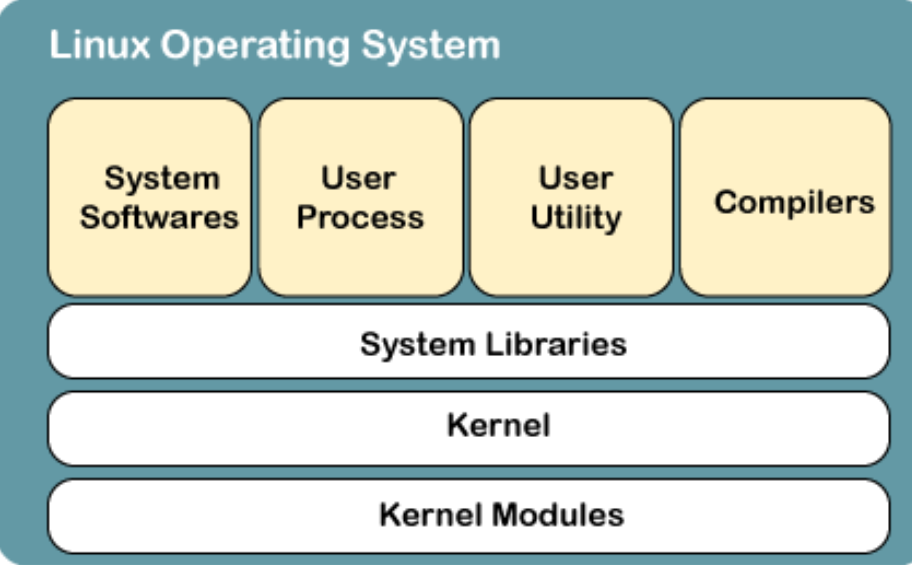
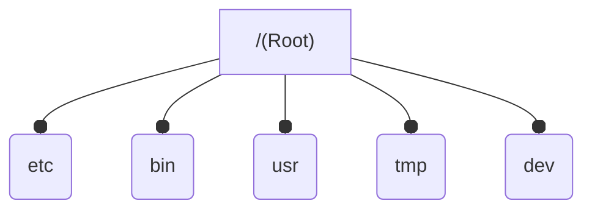

## Linux

- Linux is an `open-source operating system` like other operating systems.

## Structures of Linux

1. Kernel
2. System Library
3. System Tools

## Kernel

- It establishes communication between devices and software.
- device management
- Memory management
- Process management
- Handling system calls

## System Libraries

- System libraries are special programs that `help in accessing the kernel's features`.

## Why use Linux

- want to get rid of `viruses, malware, slowdowns, crashes, costly repairs, and many more`.
- A `global development community `look at different ways to `enhance its security`,

1. `Open-Free-Source`
2. `Security`
   1. not completely safe but it's less vulnerable than others OS.
   2. The virus is not executed until the administrator provides the access password.
3. Lightweight
   1. The requirements for running Linux are much less than other operating systems.
4. `Stability`
   1. Linux is more stable than other operating systems.
5. `Performance`
   1. Linux system provides high performance over different networks. It's capable of handling a large number of users simultaneously.
6. `Networking`
   1. It provides `various command-line tools such as ssh, ip, mail, telnet`, and more for `connectivity with the other systems and server`s. Tasks such as network backup are much faster than others.
7. Compatibility
   1. a large number of file formats as it supports almost all file formats.
8. Software Updates
   1. the software` updates are in user control`.
   2. These updates are `much faster than other operating systems`. So, the system `updates can be installed easily without facing any issue`. 

## Linux Features

- `Multiuser capability`
- `Multitasking`
- Portability
- `Security`
- File System
- Open Source

## Bash

- command language interpreter
- It supports variablesm functions, and flow control.

## What is Shell

-  it allows us to execute the commands to interact with the system. We can `perform various operations such as store and retrieve data, process information, and various`   other simple as well as complex tasks.
-  such as date, cal, `ls, and pwd` to take a tour with it.

## What is a Linux OS

### File System

- Linux uses a `tree structure to store and organize files`.

Windows | Linux |
---------|----------|
 different drives such as C, D, E |  `tree structure to store and organize files`. |
 having some `folders to store files`.
  | `everything` (Directories, devices, and files) `is considered a file`. |

## The general file system of Unix is as follows:

## Linux supports three type of users.

- Regular
- Administrator(Root)
- Service

## Regular User
- By default, all our files are `saved in the home directory (/home/)`. A regular user `cannot access the other user's directories`.

## ROOT User
- The root account is also called as `superuser` as it can access the restricted files,

## Service user
- Linux service user can `allow or deny access to various resources depending on the service type`.

## Other Directories
- `software files are stored in /bin`.
- programs and `device files are in /dev`.
- `boot files are stored in /boot` directory.