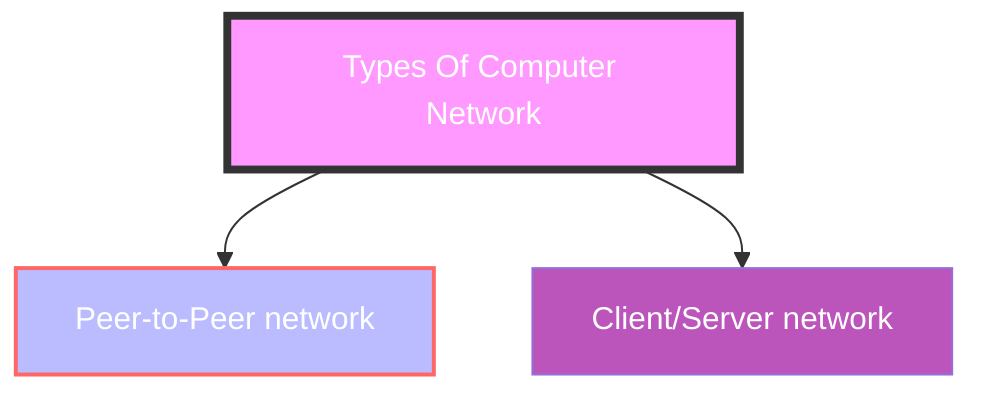
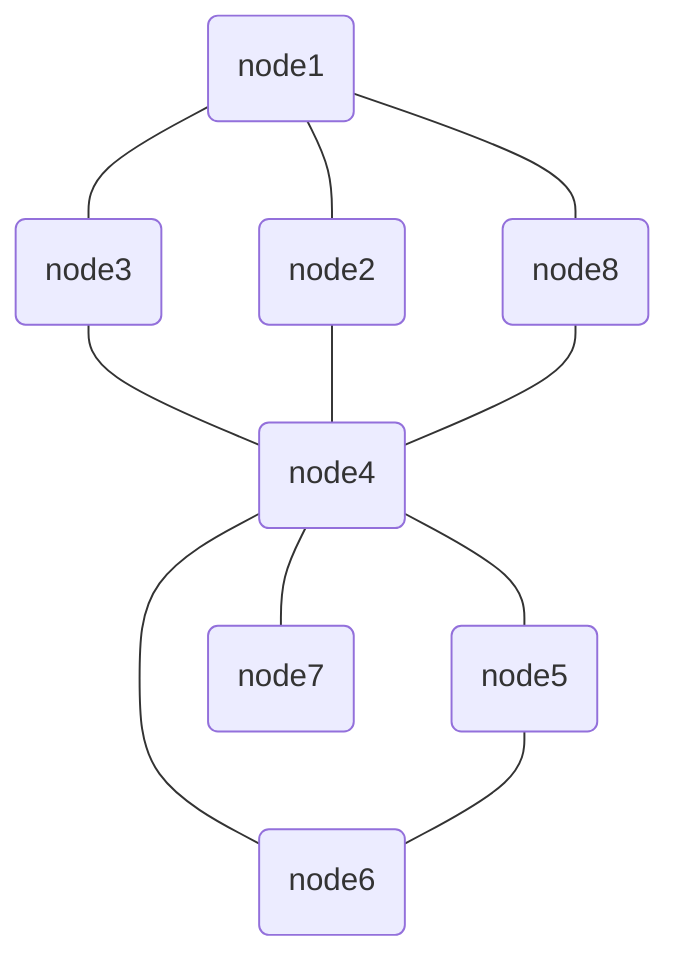
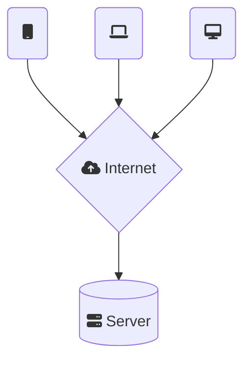

## Computer network architecture

- defined as the `physical and logical design of the software, hardware, protocols`, and media of `the transmission of data`.
- simply,how computers are organized and how tasks are allocated to the computer.

## Two types of network

- Peer-to-Peer network
- Client/Server network

## Peer-To-Peer network

- is a network in which all the computers `are linked together with equal privilege and responsibilities` for processing the data.
- Peer-To-Peer network is `useful for small environments`, usually up to 10 computers.
- Peer-To-Peer network has `no dedicated server`.
- `Special permissions are assigned to each computer` for sharing the resources, but this can lead to `a problem if the computer with the resource is down`.

## Advan. of Peer-to-Peer Network

1. It is less `costly as it does not contain any dedicated server`.
2. If one computer stops working but, other computers will not stop working.
3. It is `easy to set up and maintain as each computer manages` itself.

## disAdvan

1. it does `not contain the centralized system`. Therefore, it `cannot back up the data as the data is different in different locations`(異地備援)
2. It has a `security issue` as the device is managed itself.

## Client/Server network

- Client/Server network is a network model designed for the `end users called clients`, to `access the resources from a central computer` known as Server.

to-do

## Advantages Of Client/Server network

1. contains the `centralized system`. Therefore we can back up the data easily.
2. has a `dedicated server that improves the overall performance` of the whole system.
3. better in Client/Server network as a single server administers the shared resources.
4. `increases the speed` of the sharing resources.

## disAdv

1. requires a dedicated network administrator to manage all the resources.
2. `Client/Server network is expensive` as it requires the server `with large memory`.
