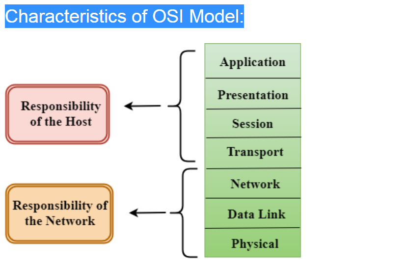
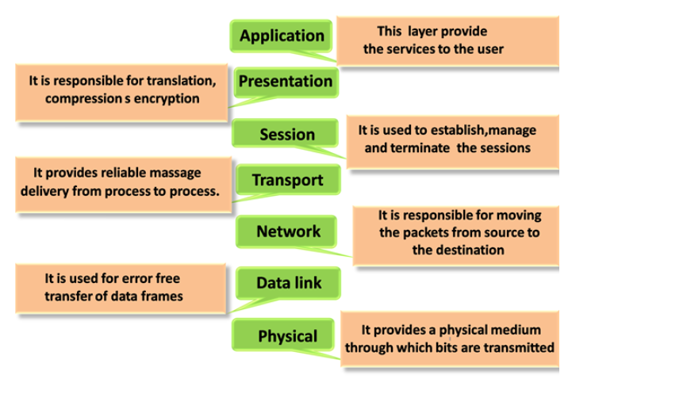

## Why do we require Layered architecture

1. Divide-and-conquer approach(分而治之)

> this approach reduce the complexity of the design.

2. Modularity(模組化)

> it provides the independence of layers,which `is easier to understand and implement`.

3. Easy to Modify

> Because of independence of layers,
> one layer can be without affecting other layers.

4. Easy to test

> Each layer of the layered architecture can be analyzed and tested individually.

## OSI Model

## Characteristics of OSI Model

## Functions of the OSI Layers

1. Physical Layer
2. Data-Link layer
3. Network layer
4. Transport layer
5. Session Layer
6. Presentation Layer
7. Application Layer

## TCP/IP Model

- The TCP/IP model was developed prior to the OSI model.
- The TCP/IP model is not exactly similar to the OSI model.
