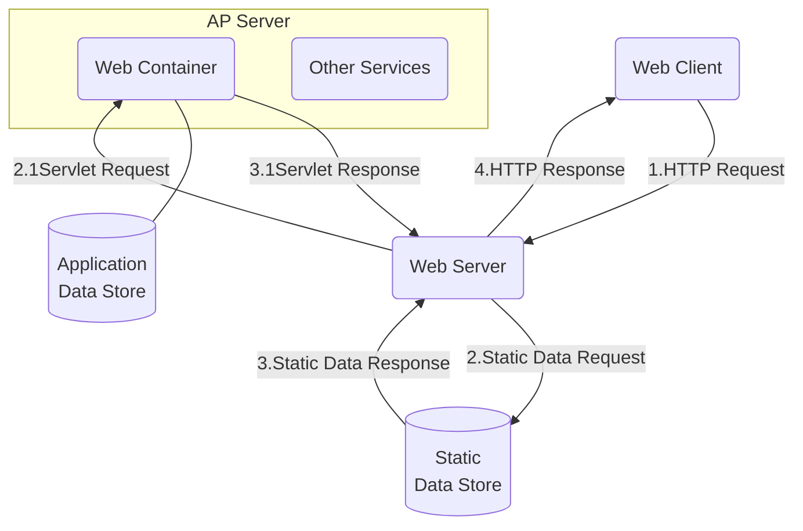

## Web Server

- It is used to manage the network resources and for running the program or software that provides services.

## Types of servers

1. Web Server
2. Application Server

## Web Server

- Web Server contains `only web or servlet container`.It can be used for servlet,jsp.But it cannot used for EJB.
- In general web server can be used to host the web site,But there are `used some other web server` also `such as FTP`,email,etc...

> Tomcat is a servlet container and web Server(??)

i.e.Apache Tomcat{Tomcat},Resin...

## Web Server Working

1. Generating response by `using the script and communicating with database`.
2. `Sending file` to the client `associated with the requested  URL`.

## The Block Diagram(方框圖) representation of Web Server

## Important points

1. requested web page is `not found`, then web server will `sends the HTTP response: Error 404 Not found`.
2. If the client requests some other resources then web server will `contact to AP-Server` and `data is store for constructing the HTTP response`.

## Application Server

- Application Server contains Web and EJB containers.It can be used for `servlet, jsp,struts` etc. It's a component based product that lies in the `middle-tier of a server centric architecture`(中間層)
- `maintenance and security`, along with `persistence and data access`.

## Example of Application Server

1. JBoss: `Open-source server from JBoss` community.
2. WebLogic:`Provided by Oracle`. It more secured.
3. Websphere: Provided by IBM.
